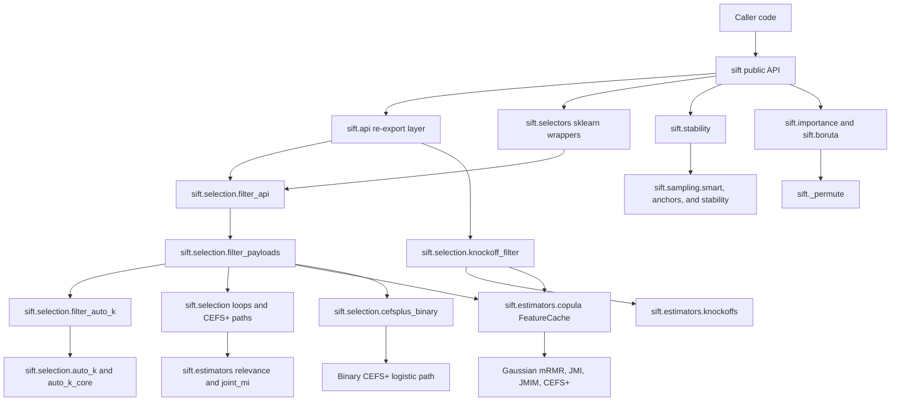

# Architecture

SIFT is a single-package Python library. It exposes a compact public API from
`sift/__init__.py`, then delegates to focused modules for preprocessing,
filter selection, estimators, sampling, model-based importance, and benchmarks.

## Package Layout

| Path | Responsibility |
| --- | --- |
| `sift/__init__.py` | Public exports and package version. |
| `sift/api.py` | Public re-export layer for function-style selectors, cache helpers, and auto-k helpers. |
| `sift/selectors.py` | Sklearn-style estimator wrappers around the function selectors. |
| `sift/_preprocess.py` and `sift/_impute.py` | Input validation, categorical encoding, weight validation, and numeric coercion. |
| `sift/selection/filter_api.py` | Spec-driven dispatcher for function-style mRMR, JMI, JMIM, CEFS+, and binary CEFS+. |
| `sift/selection/knockoff_filter.py` | q-calibrated Gaussian-copula knockoff orchestration, thresholding, result tables, and statistic registry. |
| `sift/selection/filter_payloads.py` | Fixed-k and auto-k payload builders, selector validation closures, and result payload construction. |
| `sift/selection/filter_auto_k.py` | Filter-layer orchestration around evaluate, elbow, and penalized-objective auto-k paths. |
| `sift/selection/auto_k.py` and `auto_k_core.py` | Generic k-selection mechanics, score curves, objective penalties, and prefix evaluation. |
| `sift/selection/cefsplus.py` and `cefsplus_binary.py` | Gaussian CEFS+ log-det paths and binary logistic CEFS+ paths. |
| `sift/selection/result.py` and `path_eval.py` | Result containers and explicit feature-path evaluation utilities. |
| `sift/estimators/` | Relevance scores, Gaussian copula transforms, Gaussian knockoff samplers, and joint mutual-information estimators. |
| `sift/sampling/` | Smart sampling, anchor strategies, and bootstrap split generators. |
| `sift/stability.py` | Stability selection estimator and convenience wrappers. |
| `sift/importance.py` and `sift/_permute.py` | Permutation importance and grouped/time-aware permutation strategies. |
| `sift/boruta.py` and `sift/catboost.py` | Boruta, Boruta-Shap, and optional CatBoost-based selectors. |
| `benchmarks/` | Promotion-oriented benchmark scripts and parity checks. |
| `tests/` | Regression tests for public contracts, edge cases, and performance-sensitive paths. |

## Filter Selector Layer

Function-style filter selectors share one dispatcher contract:

1. `filter_api.py` creates a `FilterRequest`, chooses a `FilterSpec`, and formats
   either a list of selected features or a `FilterSelectionResult`.
2. `filter_payloads.py` owns selector-specific work: classic paths, Gaussian
   cache paths, binary CEFS+ path construction, validation, and metadata payloads.
3. `filter_auto_k.py` owns filter-layer auto-k orchestration while `auto_k.py`
   stays focused on generic score-curve and objective mechanics.

Unsupported auto-k modes are rejected by missing handler entries in the spec
before expensive cache, encoding, or path construction.

`select_fdr` lives beside the fixed-k dispatcher rather than inside it because
its public contract is q-based, always returns a `KnockoffSelectionResult`, and
uses the knockoff+ threshold instead of a selected path prefix. It still depends
on the same rank-Gaussian `FeatureCache`: `sift.estimators.knockoffs` fits the
second-order Gaussian sampler from the cache correlation matrix, while
`sift.selection.knockoff_filter` handles target transforms, active-feature
masking, derandomized draws, metadata, and result ranking.

## Data Flow

1. Public selectors validate `X`, `y`, `k`, weights, and task-specific options.
2. The filter dispatcher resolves the selector spec and supported auto-k mode.
3. Preprocessing resolves feature names, numeric arrays, optional categorical
   encoders, imputation, and sample weights.
4. Filter selectors score relevance, prefilter candidates with `top_m`, and run
   a greedy path builder.
5. Auto-k paths optionally evaluate prefixes, objective elbows, or penalized
   objectives depending on the selector and `AutoKConfig`.
6. Outputs are returned as feature names by default, with optional selected
   indices, diagnostics, and result objects where supported.

## Optional Dependencies

Core SIFT uses `numpy`, `pandas`, `scipy`, `scikit-learn`, `joblib`, and
`numba`.

Optional dependency groups are defined in `pyproject.toml`:

- `categorical`: target, leave-one-out, and James-Stein encoders from
  `category_encoders`.
- `catboost`: CatBoost-backed selectors and SHAP-style workflows.
- `test`: pytest.
- `all`: optional categorical and CatBoost dependencies.

## Non-Goals

SIFT is not a web service, database-backed application, or deployment target.
There is no application runtime architecture, database schema, or production
deployment topology to document.
