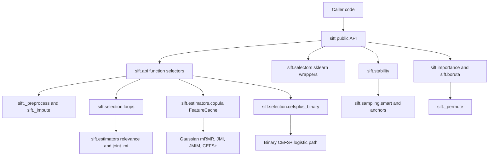

# Architecture

SIFT is a single-package Python library. It exposes a compact public API from
`sift/__init__.py`, then delegates to focused modules for preprocessing,
selection loops, estimators, sampling, model-based importance, and benchmarks.

## Package Layout

| Path | Responsibility |
| --- | --- |
| `sift/__init__.py` | Public exports and package version. |
| `sift/api.py` | Function-style selectors, auto-k routing, result metadata, and cache-aware entry points. |
| `sift/selectors.py` | Sklearn-style estimator wrappers around the function selectors. |
| `sift/_preprocess.py` and `sift/_impute.py` | Input validation, categorical encoding, weight validation, and numeric coercion. |
| `sift/selection/` | Greedy selection loops, CEFS+ implementations, auto-k logic, path evaluation, and result objects. |
| `sift/estimators/` | Relevance scores, Gaussian copula transforms, and joint mutual-information estimators. |
| `sift/sampling/` | Smart sampling and anchor strategies for large cross-section or panel data. |
| `sift/stability.py` | Bootstrap and block-bootstrap stability selection. |
| `sift/importance.py` and `sift/_permute.py` | Permutation importance and grouped/time-aware permutation strategies. |
| `sift/boruta.py` and `sift/catboost.py` | Boruta, Boruta-Shap, and optional CatBoost-based selectors. |
| `benchmarks/` | Promotion-oriented benchmark scripts and parity checks. |
| `tests/` | Regression tests for public contracts, edge cases, and performance-sensitive paths. |

## Data Flow

1. Public selectors validate `X`, `y`, `k`, weights, and task-specific options.
2. Preprocessing resolves feature names, numeric arrays, optional categorical
   encoders, imputation, and sample weights.
3. Filter selectors score relevance, prefilter candidates with `top_m`, and run
   a greedy path builder.
4. Auto-k paths optionally evaluate prefixes, objective elbows, or penalized
   objectives depending on the selector and `AutoKConfig`.
5. Outputs are returned as feature names by default, with optional selected
   indices, diagnostics, and result objects where supported.

## Optional Dependencies

Core SIFT uses `numpy`, `pandas`, `scipy`, `scikit-learn`, `joblib`, and
`numba`.

Optional dependency groups are defined in `setup.py`:

- `categorical`: target, leave-one-out, and James-Stein encoders from
  `category_encoders`.
- `catboost`: CatBoost-backed selectors and SHAP-style workflows.
- `test`: pytest.
- `all`: optional categorical and CatBoost dependencies.

## Non-Goals

SIFT is not a web service, database-backed application, or deployment target.
There is no application runtime architecture, database schema, or production
deployment topology to document.
