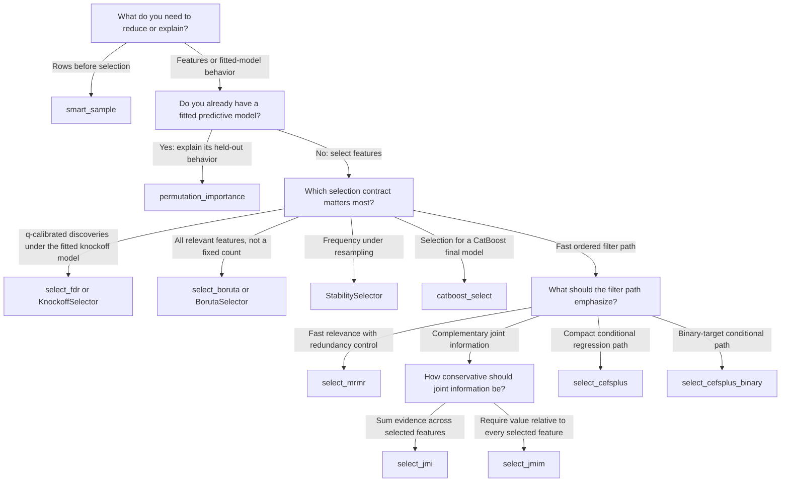

# Choosing a Selector

Choose the branch that matches the *output contract* you need. Several methods
may work on the same dataset, but they answer different questions: a fixed-size
ranking, an all-relevant set, a resampling diagnostic, and a q-calibrated
knockoff set are not interchangeable.

## Read the leaves correctly

- `select_mrmr` is the default fast baseline for regression or classification.
  It favors relevance while penalizing redundancy with the current path, and
  can use `select_mrmr(..., estimator="gaussian")` when the Gaussian-copula
  path or cache is appropriate.
- `select_jmi` favors features that add complementary joint information.
  `select_jmim` replaces JMI's aggregate with a minimum and is therefore the
  more conservative of the two.
- `select_cefsplus` is a Gaussian-copula conditional-information path for
  continuous regression targets. A 2-D `y` (`n×q`, `q≥2`) is joint
  multi-target CEFS+; other filters reject it rather than flattening.
  `select_cefsplus_binary` uses a logistic
  score-test path by default. Its `loss="brier"` option delegates to
  `select_cefsplus` with a 0/1 floating-point target and exposes the Gaussian
  selector's options; it is not a second binary score-test path.
- `select_fdr` and `KnockoffSelector` return a q-calibrated set rather than a
  fixed-size prefix. Their guarantee is approximate plug-in Gaussian-copula
  validity unless the fitted feature model is the true Model-X distribution;
  an empty selected set is valid.
- Boruta asks which features repeatedly beat randomized shadows. It is an
  all-relevant heuristic, so it may retain redundant members of one signal
  family. `select_boruta_shap` changes the importance backend, not that contract.
- `StabilitySelector` thresholds selection frequency over Lasso or logistic
  resamples. Use it for robustness diagnostics, not as a substitute for knockoff
  FDR control. `Stabilized(selector)` is the generic wrapper for the same
  frequency contract around any cloneable selector; `aggregation="evalues"` is
  the already-validated KnockoffSelector full-data derandomization path, not a
  bootstrap average of e-values.
- `ModelSelector` wraps a cloned sklearn estimator for RFE, forward, or
  stability selection. Use it when importance should come from that estimator
  and, if needed, from purged group/time folds or opt-in nested scoring.
  Outer-validation scores are not the curve that chooses `k`.
- `catboost_select` is appropriate when selection should follow the nonlinear
  behavior of a CatBoost model and the optional dependency is acceptable.
  It is not a `ModelSelector` wrapper.
- `permutation_importance` ranks columns for an already-fitted estimator on the
  data supplied to it. Use held-out data when the ranking should describe
  out-of-sample behavior.
- `smart_sample` reduces rows, not columns. Apply it before a selector when the
  full panel is too large for the chosen method.

## Apply the workflow modifiers

After choosing the statistical contract:

1. Use the matching selector class (`MRMRSelector`, `JMISelector`,
   `JMIMSelector`, `CEFSPlusSelector`, `CEFSPlusBinarySelector`, or
   `KnockoffSelector`) when the selector must live inside an sklearn pipeline.
2. Treat fixed `k` as an upper bound. Use `k="auto"` and `AutoKConfig` only when
   you want SIFT to size a filter path; auto-k does not change what the path's
   underlying selector optimizes.
3. Build a `FeatureCache` when the same numeric feature matrix is reused across
   many targets or Gaussian selectors.
4. Use group/time-aware evaluation, target encoding, permutation, or resampling
   only through entry points that document that row context. Fixed-k function
   filters reject `groups` and `time` by design.

For exact signatures, accepted values, and return types, use the
[generated API reference](reference/index.md). For mathematical details, see
the [algorithm guide](ALGORITHMS.md); for a worked first path, continue with the
[tutorial](user-guide.md) and [advanced workflows](ADVANCED.md). Consult the
[runtime and scaling guide](runtime-scaling.md) for measured cost context, the
[knockoff statistic bakeoff](knockoff-statistic-bakeoff.md) for the seeded
relevance/ridge quality record, and
the [data-type support matrix](data-type-support.md) for ndarray vs DataFrame,
categoricals, sparse input, datetime columns, sample weights, and group/time
metadata. The [glossary](glossary.md) defines path, k, q, and related contracts.
